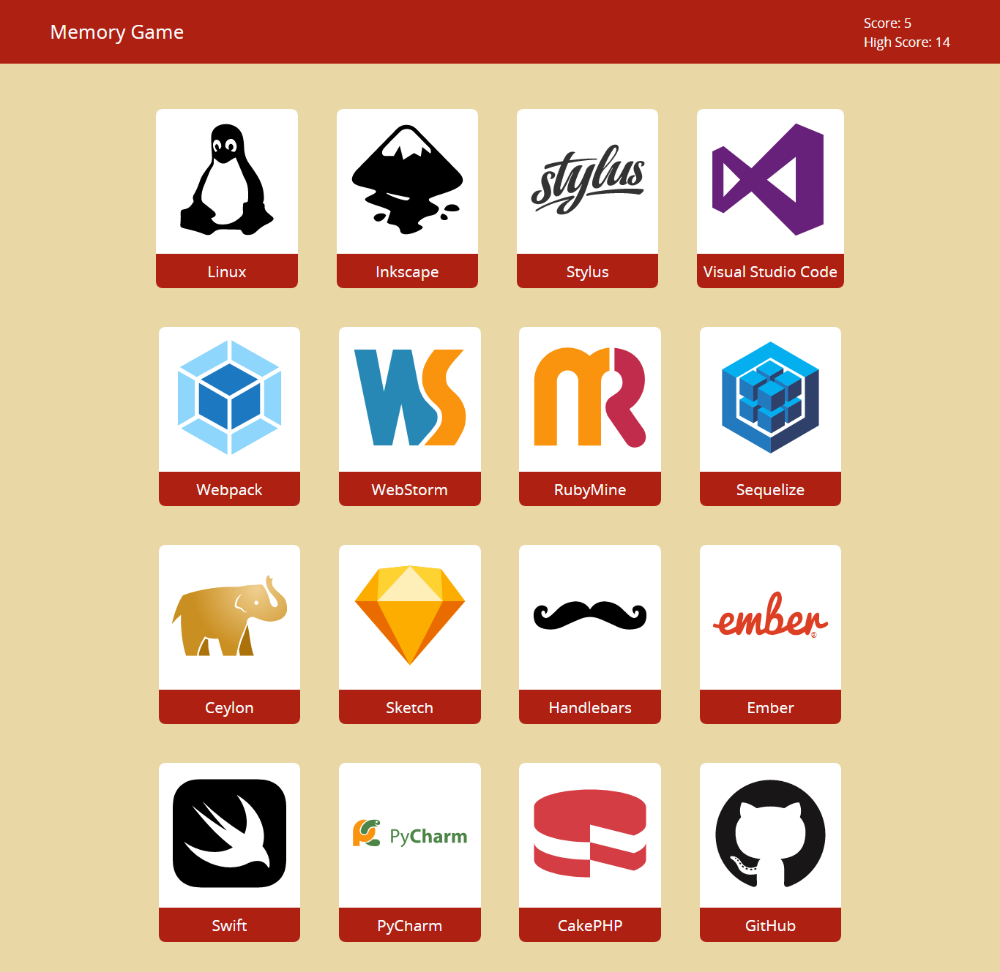

# Memory Game

This is a memory game made with React to practice using functional components and state handling.
Built as part of [The Odin's Project curriculum](https://www.theodinproject.com)

[Live demo here](https://peter-abah.github.io/memory-game)

## Overview
The purpose of the game is to click on every every only once.
The score updates every time you click on a picture. If the picture has not been clicked the score increases by one, else the score resets to zero.

The cards are shuffled after every click.

## Screenshot

## Built With
- HTML
- CSS
- JavaScript
- SCSS
- React

## Acknoledgements
- Project gotten from [The Odin Project](https://www.theodinproject.com)
